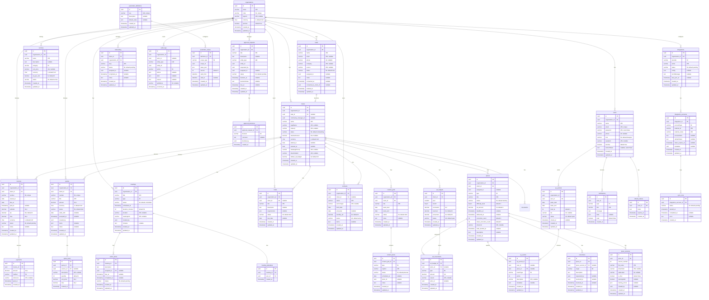

# VITAHUB Entity Relationship Diagram

```mermaid
erDiagram
    organizations ||--o{ users : "has"
    organizations ||--o{ clients : "has"
    organizations ||--o{ leads : "has"
    organizations ||--o{ meetings : "has"
    organizations ||--o{ services : "catalog"
    organizations ||--o{ quotes : "belongs"
    organizations ||--o{ invoices : "belongs"
    organizations ||--o{ integrations : "configures"
    organizations ||--o{ approval_requests : "manages"
    organizations ||--o{ briefs : "owns"
    organizations ||--o{ contracts : "owns"
    organizations ||--o{ onboarding : "manages"
    organizations ||--o{ audit_logs : "tracks"
    leads ||--o| clients : "becomes"
    clients ||--o{ pieces : "has"
    clients ||--o{ ud_budgets : "has"
    clients ||--o{ meetings : "has"
    clients ||--o{ content_grids : "has"
    clients ||--o{ contracts : "has"
    clients ||--o{ quotes : "receives"
    clients ||--o{ invoices : "receives"
    clients ||--o{ documents : "has"
    clients ||--o{ briefs : "has"
    pieces ||--o{ piece_versions : "has"
    pieces ||--o{ corrections : "has"
    pieces ||--o{ ud_movements : "references"
    pieces ||--o{ xp_events : "awards"
    ud_budgets ||--o{ ud_movements : "tracks"
    users ||--o{ xp_periods : "earns"
    users ||--o{ notifications : "receives"
    users ||--o{ refresh_tokens : "has"
    xp_periods ||--o{ xp_events : "contains"
    meetings ||--o{ meeting_attendees : "has"
    meetings ||--o{ action_items : "has"
    content_grids ||--o{ content_items : "contains"
    quotes ||--o{ quote_items : "has"
    invoices ||--o{ payments : "receives"
    integrations ||--o{ integration_accounts : "has"
    integration_accounts ||--o{ sync_runs : "logs"
    approval_requests ||--o{ approval_decisions : "has"
    parameter_definitions ||--o{ parameter_values : "configures"

    organizations {
        uuid id PK
        varchar name "255"
        varchar code "50, unique"
        varchar logoUrl "255, nullable"
        char currency "3, default CLP"
        boolean isActive "default true"
        timestamp created_at
        timestamp updated_at
    }

    users {
        uuid id PK
        uuid organization_id FK
        varchar name "255"
        varchar email "255, unique"
        varchar password "255, select:false"
        varchar phone "20, nullable"
        varchar role "50, default designer"
        varchar avatarUrl "255, nullable"
        boolean isActive "default true"
        text refreshToken "nullable, select:false"
        timestamp created_at
        timestamp updated_at
    }

    clients {
        uuid id PK
        uuid organization_id FK
        uuid lead_id FK "nullable"
        uuid community_manager_id "nullable"
        varchar name "255"
        varchar legalName "255, nullable"
        varchar industry "255, nullable"
        varchar status "50, default onboarding"
        decimal retainerAmount "18,2 nullable"
        char currency "3, default CLP"
        date started_at "nullable"
        date renewal_at "nullable"
        varchar whatsappGroup "255, nullable"
        varchar driveFolderId "255, nullable"
        decimal default_ud_budget "8,2 default 20"
        timestamp created_at
        timestamp updated_at
    }

    leads {
        uuid id PK
        uuid organization_id FK
        varchar name "255"
        varchar email "255, nullable"
        varchar phone "20, nullable"
        varchar company "255, nullable"
        varchar source "255, nullable"
        varchar status "50, default new"
        uuid assigned_to "nullable"
        text notes "nullable"
        timestamp converted_at "nullable"
        uuid converted_to_client_id "nullable"
        timestamp created_at
        timestamp updated_at
    }

    pieces {
        uuid id PK
        uuid organization_id FK
        uuid client_id FK
        uuid assigned_to "nullable"
        varchar type "50"
        varchar title "255"
        varchar status "50, default backlog"
        tinyint difficulty_level "default 1"
        decimal ud_amount "8,2 default 0"
        timestamp deadline_at "nullable"
        timestamp delivered_at "nullable"
        int correction_count "default 0"
        int client_correction_count "default 0"
        varchar driveLink "255, nullable"
        timestamp stale_alerted_at "nullable"
        text description "nullable"
        timestamp created_at
        timestamp updated_at
    }

    piece_versions {
        uuid id PK
        uuid piece_id FK
        int version_number
        varchar file_name "255"
        varchar driveFileId "255, nullable"
        varchar stateLabel "50, nullable"
        boolean is_final "default false"
        boolean namingValid "nullable"
        json naming_errors "nullable"
        uuid created_by "nullable"
        timestamp created_at
        timestamp updated_at
    }

    corrections {
        uuid id PK
        uuid piece_id FK
        uuid piece_version_id FK "nullable"
        varchar origin "50"
        text description
        uuid requested_by "nullable"
        uuid resolved_by "nullable"
        timestamp resolved_at "nullable"
        timestamp created_at
        timestamp updated_at
    }

    content_grids {
        uuid id PK
        uuid organization_id FK
        uuid client_id FK
        varchar title "255"
        date week_start
        date week_end
        varchar status "50, default draft"
        text notes "nullable"
        timestamp created_at
        timestamp updated_at
    }

    content_items {
        uuid id PK
        uuid content_grid_id FK
        varchar type "50"
        varchar caption "255"
        varchar status "50, default planned"
        date scheduled_at "nullable"
        uuid piece_id "nullable"
        text notes "nullable"
        timestamp created_at
        timestamp updated_at
    }

    ud_budgets {
        uuid id PK
        uuid client_id FK
        smallint year
        tinyint month
        decimal contracted "8,2"
        decimal reserved "8,2 default 0"
        decimal consumed "8,2 default 0"
        varchar status "20, default open"
        timestamp created_at
        timestamp updated_at
    }

    ud_movements {
        uuid id PK
        uuid ud_budget_id FK
        uuid piece_id FK "nullable"
        varchar type "50"
        decimal amount "8,2"
        varchar reason "255, nullable"
        uuid actor_id "nullable"
        timestamp created_at
        timestamp updated_at
    }

    xp_periods {
        uuid id PK
        uuid organization_id
        uuid user_id FK
        date week_start
        date week_end
        int total_xp "default 0"
        varchar tier "20, nullable"
        varchar status "20, default open"
        timestamp closed_at "nullable"
        timestamp created_at
        timestamp updated_at
    }

    xp_events {
        uuid id PK
        uuid xp_period_id
        uuid user_id "nullable"
        uuid piece_id FK "nullable"
        varchar eventType "50"
        int points
        varchar description "255, nullable"
        json metadata "nullable"
        timestamp created_at
        timestamp updated_at
    }

    meetings {
        uuid id PK
        uuid organization_id FK
        varchar title "255"
        varchar type "50"
        varchar status "50, default scheduled"
        timestamp scheduled_at
        int duration_minutes "default 60"
        varchar location "255, nullable"
        varchar meetingLink "255, nullable"
        uuid created_by
        text minutes "nullable"
        timestamp created_at
        timestamp updated_at
    }

    meeting_attendees {
        uuid id PK
        uuid meeting_id FK
        uuid user_id FK
        timestamp created_at
    }

    action_items {
        uuid id PK
        uuid meeting_id FK
        text description
        uuid assigned_to FK "nullable"
        timestamp due_at "nullable"
        timestamp completed_at "nullable"
        varchar status "50, default pending"
        timestamp created_at
        timestamp updated_at
    }

    services {
        uuid id PK
        uuid organization_id FK
        varchar name "255"
        text description "nullable"
        varchar category "50"
        decimal unit_price "18,2 nullable"
        char currency "3, default CLP"
        decimal ud_per_unit "8,2 default 0"
        varchar status "50, default active"
        timestamp created_at
        timestamp updated_at
    }

    quotes {
        uuid id PK
        uuid organization_id FK
        uuid client_id FK
        varchar number "50, unique"
        varchar title "255"
        decimal amount "18,2"
        char currency "3, default CLP"
        varchar status "50, default draft"
        date valid_until "nullable"
        timestamp accepted_at "nullable"
        uuid created_by
        json items "nullable"
        text notes "nullable"
        timestamp created_at
        timestamp updated_at
    }

    quote_items {
        uuid id PK
        uuid quote_id FK
        uuid service_id FK "nullable"
        varchar description "255, nullable"
        int quantity "default 1"
        decimal unit_price "18,2"
        decimal total "18,2"
        timestamp created_at
    }

    invoices {
        uuid id PK
        uuid organization_id FK
        uuid client_id FK
        varchar number "50, unique"
        date issued_at
        date due_at
        timestamp paid_at "nullable"
        decimal subtotal "18,2"
        decimal tax "18,2 default 0"
        decimal total "18,2"
        char currency "3, default CLP"
        varchar status "20, default pending"
        text notes "nullable"
        timestamp created_at
        timestamp updated_at
    }

    payments {
        uuid id PK
        uuid invoice_id FK
        decimal amount "18,2"
        varchar method "50"
        varchar reference "255, nullable"
        timestamp paid_at
        timestamp created_at
    }

    integrations {
        uuid id PK
        uuid organization_id FK
        varchar provider "50"
        varchar name "255"
        varchar status "50, default pending"
        json config "nullable"
        text errorMessage "nullable"
        timestamp last_sync_at "nullable"
        timestamp created_at
        timestamp updated_at
    }

    integration_accounts {
        uuid id PK
        uuid integration_id FK
        varchar accountType "50"
        varchar external_id "255"
        varchar external_name "255"
        text accessToken "nullable"
        text refreshToken "nullable"
        timestamp token_expires_at "nullable"
        json metadata "nullable"
        timestamp created_at
        timestamp updated_at
    }

    sync_runs {
        uuid id PK
        uuid integration_account_id FK
        varchar status "50, default pending"
        timestamp started_at
        timestamp completed_at "nullable"
        text error "nullable"
        timestamp created_at
    }

    approval_requests {
        uuid id PK
        uuid organization_id FK
        varchar title "255"
        text description "nullable"
        varchar entity_type "100"
        uuid entity_id
        uuid requested_by
        uuid assigned_to "nullable"
        varchar status "50, default pending"
        timestamp decision_at "nullable"
        text decisionNotes "nullable"
        timestamp due_at "nullable"
        timestamp created_at
        timestamp updated_at
    }

    approval_decisions {
        uuid id PK
        uuid approval_request_id FK
        varchar decision "50"
        text comment "nullable"
        uuid decided_by
        timestamp created_at
    }

    briefs {
        uuid id PK
        uuid organization_id FK
        uuid client_id FK "nullable"
        varchar title "255"
        text description "nullable"
        json requirements "nullable"
        varchar status "20, default draft"
        date due_date "nullable"
        timestamp created_at
        timestamp updated_at
    }

    contracts {
        uuid id PK
        uuid organization_id FK
        uuid client_id FK "nullable"
        varchar name "255"
        varchar serviceType "255, nullable"
        date start_date
        date end_date "nullable"
        decimal monthly_ud "8,2 default 0"
        varchar status "20, default active"
        text terms "nullable"
        timestamp created_at
        timestamp updated_at
    }

    onboarding {
        uuid id PK
        uuid client_id FK
        uuid organization_id FK
        varchar step "255"
        varchar status "20, default pending"
        uuid assigned_to "nullable"
        timestamp completed_at "nullable"
        text notes "nullable"
        timestamp created_at
        timestamp updated_at
    }

    notifications {
        uuid id PK
        uuid user_id
        varchar type "50"
        varchar title "255"
        text message
        json data "nullable"
        boolean read "default false"
        timestamp created_at
    }

    refresh_tokens {
        uuid id PK
        uuid user_id FK
        text token
        timestamp expires_at
        timestamp created_at
    }

    parameter_definitions {
        uuid id PK
        varchar key "100, unique"
        text description "nullable"
        json default_value "nullable"
        timestamp created_at
        timestamp updated_at
    }

    parameter_values {
        uuid id PK
        uuid definition_id FK
        varchar scope_type "50"
        uuid scope_id
        json value_json
        int version "default 1"
        datetime valid_from
        datetime valid_to "nullable"
        timestamp created_at
        timestamp updated_at
    }

    audit_logs {
        uuid id PK
        uuid organization_id
        uuid actor_id "nullable"
        varchar entity_type "100"
        uuid entity_id
        varchar action "50"
        json before "nullable"
        json after "nullable"
        text reason "nullable"
        varchar ipAddress "45, nullable"
        timestamp occurred_at
    }
```
